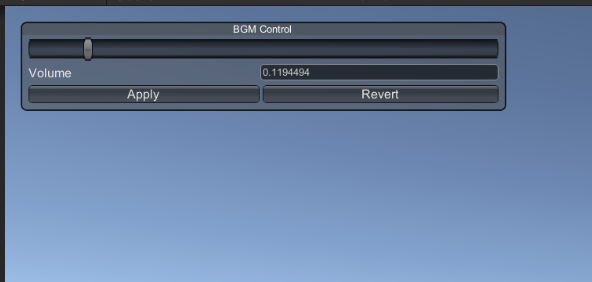

# UVolumeControl
 A sound settings manager for Unity

# Display

# Environment
This is to be run on Windows systems, tested on Windows 10 and Unity 2019.4.14f1

# Installation
Install Node JS and use [packman](https://github.com/appetizermonster/unity-packman) to install

# Usage
* Press V to toggle hide/display
* Move slider or directly input the desired volume, in the range of 0 to 1
* Press Apply to save settings. Settings will be saved and loaded on the next load
* Press Revert to restore the last settings __before pressing Apply__
* Settings are stored to persistent data path, as JSON file
